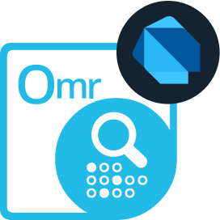

---
title: Dart and Flutter SDK for creating and recognizing OMR forms
description: Create and recognize machine-readable OMR forms on Android, iOS, Linux, macOS, Windows, and other platforms using Flutter open source framework.
weight: 90
url: /dart
---










Aspose.OMR Cloud is an easy-to-use and versatile online service for designing, rendering and recognizing hand-filled answer sheets, surveys, questionnaires, tests, insurance claims, and similar machine-readable forms. With it, you can quickly develop desktop, web and mobile applications for optical mark recognition (OMR) that require minimal resources on the client side - all the work is performed by remote services.

This software development kit (SDK) makes it easy for cross-platform Flutter applications written in Dart to interact with Aspose.OMR Cloud services. With it, you can focus on the task at hand, not the technical details. It handles all the routine operations such as establishing connections, sending API requests, and parsing responses, consolidating all these tasks into a few simple methods.

This SDK, demo apps, and form templates are distributed under the MIT license. You can modify them to suit your needs and use them in any commercial and free projects.



<!--Diagrams Start-->




	<header>
	<i class="fa fa-bars">
	</i>
	Create OMR forms
	</header>
	<ul>
		<li>Powerful markup languages</li>
		<li>More than 20 predefined elements</li>
		<li>QR codes and barcodes</li>
		<li>Add images and branding</li>
		<li>All popular paper sizes</li>
		<li>No graphic editors required</li>
	</ul>

<!--/left-->

	<header>
	<i class="fa fa-eye">
	</i>
	Recognize OMR forms
	</header>
	<ul>
		<li>Read scanned images and photos</li>
		<li>Superior recognition accuracy</li>
		<li>No equipment needed</li>
		<li>Adjust rotated & skewed images</li>
		<li>Recognize all types of marks</li>
		<li>Recognition accuracy tuning</li>
		<li>Decode QR codes and barcodes</li>
		<li>Process write-in fields</li>
	</ul>

<!--/right-->

<!--/row-->

<header>Aspose.OMR</header><footer>Cloud <small> <em>for </em> </small>Dart</footer>

<!--/logo-->

<!--/diagram1-->




	<header>
	<i class="fa fa-arrows-v">
	</i>
	Printable forms
	</header>
	<ul>
		<li>PDF</li>
		<li>JPEG</li>
		<li>PNG</li>
		<li>TIFF</li>
		<li>GIF</li>
		<li>BMP</li>
	</ul>

<!--/left-->

	<header>
	<i class="fa fa-long-arrow-down">
	</i>
	Recognition results
	</header>
	<ul>
		<li>CSV</li>
		<li>JSON</li>
		<li>XML</li>
	</ul>

<!--/right-->

<!--/row-->

<header>Aspose.OMR</header><footer>Cloud <small> <em>for </em> </small>Dart</footer>

<!--/logo-->

<!--/diagram2-->







<!--Diagrams End-->

<!--Feature-section Start-->

 
 

  

   <h2 class="pr-ft">
    Features and Capabilities of OMR Cloud Service
   </h2>
   
 

   

    <em class="fa fa-mobile-phone ico-blue fa-2x col-lg-2">
    </em>
    

     Use your smartphone camera instead of a scanner
    

   

   

    <em class="fa fa-check ico-blue fa-2x col-lg-2">
    </em>
    

     Read all types of marks drawn with a pen, pencil or marker
    

   

   

    <em class="fa fa-image ico-blue fa-2x col-lg-2">
    </em>
    

     Supports all image formats you can get from a scanner or camera
    

   

   

    <em class="fa fa-pencil ico-blue fa-2x col-lg-2">
    </em>
    

     Processes write-in fields and custom drawings
    

   

   

    <em class="fa fa-eye ico-blue fa-2x col-lg-2">
    </em>
    

     Superior recognition accuracy for reliable results
    

   

   

    <em class="fa fa-sliders ico-blue fa-2x col-lg-2">
    </em>
    

     Fine-tune recognition parameters to handle difficult cases
    

   

   

    <em class="fa fa-barcode ico-blue fa-2x col-lg-2">
    </em>
    

     Powerful markup languages for creating all types of forms
    

   

   

    <em class="fa fa-qrcode ico-blue fa-2x col-lg-2">
    </em>
    

     Personalize forms with barcodes, QR codes, branding and images
    

   

   

    <em class="fa fa-cloud ico-blue fa-2x col-lg-2">
    </em>
    

     Requires minimal resources on the end user devices
    

   

   

   

   

    

     

      <h2 class="h2title">Quick start</h2>
      
This SDK makes it easy to integrate your Flutter application with our service. You can forget about tons of low-level code like request flow, HTTP headers, error handling, and the like - all tasks are done in a few lines of Dart code that even inexperienced developers can maintain.

      
OMR SDK for Dart comes with a number of fully-functional examples, that allow you to quickly familiarize yourself with its functions and capabilities and give you an idea of creating solutions for your business needs.

     

     

      <h2 class="h2title">Wide range of applications</h2>
      
Optical Mark Recognition (OMR) technology has many applications and can greatly simplify almost any part of your life when you need to collect and analyze manually filled data. It fully automates the process, allowing hundreds of sheets per minute to be recognized with nearly 100% accuracy, and saves the results directly to a database for further aggregation and analysis. Applications include but are not limited to:

      <ul>
      	<li>Education: answer sheets, tests, quizzes, SAT forms, and many more.</li>
      	<li>Questionnaires: customer satisfaction surveys, feedback forms, orders, meal preferences.</li>
      	<li>Applications: insurance claims, financial applications, border entry forms.</li>
      	<li>And many more.</li>
      </ul>
     

     

      <h2 class="h2title">Create forms without design tools</h2>
      
Our API supports the complete OMR workflow - from designing a form to recognizing its scanned hardcopies. It offers highly flexible JSON and text markups with <b>20</b> layout and content elements that can be combined with each other to produce forms of any layout can complexity.

      
Forms are generated in most popular graphic formats, as well as PDF documents, which allows you to print them on a regular printer or on high-quality typographical equipment.

     

     

      <h2 class="h2title">No specialized equipment required</h2>
      
You no longer need specialized scanners, paper, and other “hardware” solutions. Advanced image analysis and artificial intelligence techniques made it possible to use a regular pen and paper, common office copier, or even a smartphone camera instead of dedicated devices, without affecting recognition accuracy and confidence in the result. Our API allows for building purely software OMR solutions that compete on par with traditional hardware-based systems at a much lower cost.

      
Aspose.OMR Cloud is an on-demand service that runs in a high-performance cloud. As such, it has no special hardware or operating system requirements - you can use it even on entry-level systems and mobile devices without loss of accuracy and performance.

     

     

      <h2 class="h2title">Unlimited possibilities with Aspose Cloud solutions</h2>
      
An account in Aspose Cloud grants you access to the full range of our <a href="https://www.aspose.cloud/">cloud APIs</a>. You can read write-in fields with OCR, build document and presentations from aggregated recognition results, analyze survey data with pivot tables. All tasks are performed in the same way, which significantly speeds up development, reduces learning and maintenance costs, even for the most advanced business solution.

     

    

   

  

<!--Feature-section End-->



























	
	
	
	
	
	
	



